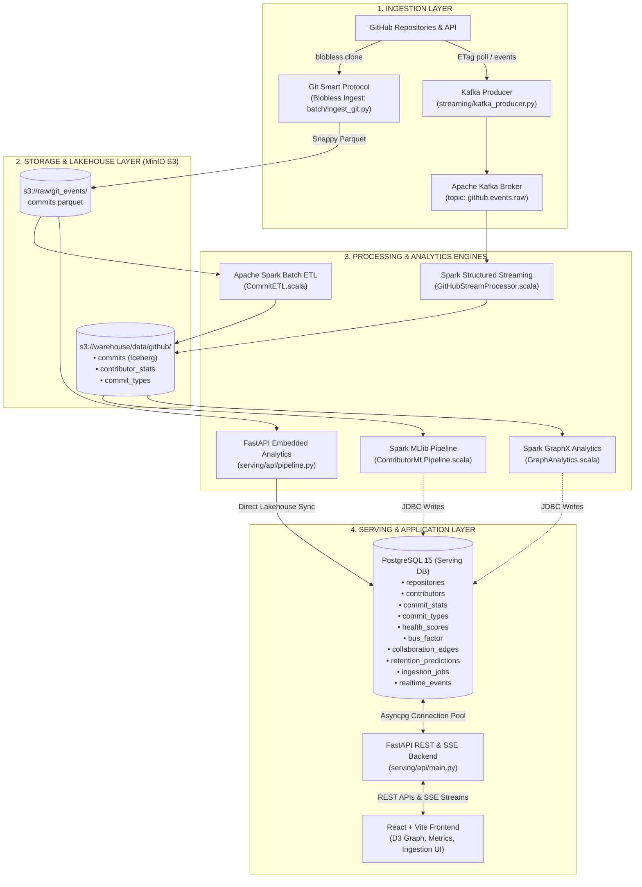

# GitHub Contribution Analytics Lakehouse: Architecture & Implementation Status Review

> **Document Version**: 1.0.0  
> **Date**: October 2026  
> **Repository**: `bigdata-pro`  
> **Status**: Core Lakehouse & Ingestion Operational | Serving Layer Functional | Frontend & Spark Bridge Pending

---

## 1. Executive Summary & Project Vision

The **GitHub Contribution Analytics Lakehouse** is an enterprise-grade big data platform engineered to ingest, process, store, analyze, and serve GitHub contribution intelligence at scale. Modern open-source ecosystems and enterprise software organizations face visibility challenges regarding developer turnover, knowledge silos (bus-factor risk), codebase health, and collaboration dynamics.

This project solves this by combining:
1. **High-Speed Historical Ingestion**: Using the Git Smart Protocol (`--filter=blob:none --no-checkout`) to clone metadata without downloading gigabytes of source tree files, converting commit histories into snappy-compressed Apache Parquet stored on MinIO object storage.
2. **Real-Time Streaming**: Ingesting GitHub Events API activity into Apache Kafka via conditional ETag polling, processed through Apache Spark Structured Streaming with watermark handling.
3. **Open Lakehouse Architecture**: Apache Iceberg table format providing ACID transactions, time travel, schema evolution, and hidden partitioning on MinIO S3 object storage.
4. **Distributed Analytics & ML (Spark 3.5.3 + Scala)**:
   - Batch ETL (`CommitETL.scala`) deduplicating commits and rolling up monthly contributor metrics.
   - Contributor Retention ML Pipeline (`ContributorMLPipeline.scala`) using RandomForest and K-Means clustering.
   - Graph Analytics (`GraphAnalytics.scala`) using Apache Spark GraphX for PageRank, degree centrality, and module bus-factor risk detection.
5. **High-Performance Serving Layer**: PostgreSQL 15 relational datastore pre-aggregated for sub-50ms query latencies, accompanied by an asynchronous FastAPI backend supporting background tasks, UUID-based job tracking, and Server-Sent Events (SSE).
6. **Unified Analytics Dashboard** *(Roadmap)*: React + Vite web application with interactive D3.js force-directed collaboration graphs, health gauges, and live event monitors.

---

## 2. End-to-End System Architecture



---

## 3. Comprehensive Audit: What is Currently Implemented

### 3.1 Infrastructure & Containers (`docker-compose.yml`)

The runtime environment is orchestrated via Docker Compose on the `lakehouse` bridge network. Currently verified running containers:

| Container Name | Image | Host Port | Status | Function |
|---|---|---|---|---|
| `zookeeper` | `confluentinc/cp-zookeeper:7.5.0` | `2181` | **Healthy / Running** | Kafka coordinator |
| `kafka` | `confluentinc/cp-kafka:7.5.0` | `9092`, `9101` | **Healthy / Running** | Event streaming broker |
| `kafka-ui` | `provectuslabs/kafka-ui:latest` | `8090` | **Healthy / Running** | Kafka web administration console |
| `minio` | `cgr.dev/chainguard/minio:latest` | `9000` (API), `9001` (UI) | **Healthy / Running** | Local S3-compatible object storage |
| `minio-init` | `cgr.dev/chainguard/minio-client` | N/A | **Exited 0** | Bucket initialisation (`raw`, `warehouse`, `lakehouse`) |
| `spark-master` | `apache/spark:3.5.3` | `7077`, `8080` (UI) | **Healthy / Running** | Spark master coordinator |
| `spark-worker-1`| `apache/spark:3.5.3` | `8081` (UI) | **Healthy / Running** | Spark worker node (2 cores, 2GB memory) |
| `postgres` | `postgres:15` | `5432` | **Healthy / Running** | Serving relational database |
| `api` | `bigdata-pro-api` (custom build) | `8000` | **Healthy / Running** | FastAPI backend with background workers |
| `hive-metastore`| `apache/hive:4.0.0` | `9083` | Profile `metastore` (dormant) | Optional Hive Metastore service |
| `frontend` | `./frontend/Dockerfile` | `3000` | Profile `app` (not started) | React dashboard service |

---

### 3.2 Database Schema & Active Lakehouse State

The database schema defined in `infra/postgres/init.sql` is fully applied and active in PostgreSQL (`github_analytics`). Current table populations verified via direct database inspection:

| Table | Rows Populated | Schema Description & Purpose |
|---|---|---|
| `repositories` | **2** | Tracked repositories (`expressjs/express`, `pallets/click`), default branch, language, head commit hash, sync status. |
| `contributors` | **863** | Unique GitHub developers, first seen date, last seen date, total historical commits. |
| `commit_stats` | **1,552** | Monthly contributor rollups: `commit_count`, `insertions`, `deletions`, `files_changed`. |
| `commit_types` | **1,439** | Monthly commit taxonomy (`BUG_FIX`, `FEATURE`, `REFACTOR`, `DOCUMENTATION`, `PERFORMANCE`, `TEST`, `SECURITY`, `DEVOPS`, `OTHER`). |
| `health_scores` | **3** | Multi-attribute health indices: contributor diversity (Shannon entropy), retention, consistency, bus factor safety, and composite 0-100 score. |
| `bus_factor` | **60** | Module and directory-level bus factor scores, top code owner identity, and percentage contribution concentration. |
| `collaboration_edges` | **2,064** | Pairwise developer co-editing interactions across project modules with interaction weights and periods for D3 graph visualization. |
| `retention_predictions` | **2,592** | 30/60/90-day retention probabilities, persona clusters (`Core Maintainer`, `Regular`, `Casual`, `One-Time`), and explainability JSON feature vectors. |
| `ingestion_jobs` | **5** | Asynchronous job state tracker with UUIDs, status machine, percentage progress, commit counts, and error tracking. |
| `realtime_events` | **0** | Real-time event staging table for incoming Kafka streaming events. |

---

### 3.3 Storage State (MinIO S3 Buckets)

- **Bucket `s3://raw/`**:
  - `git_events/repository=expressjs__express/commits.parquet` (502 KiB, 6,173 commits)
  - `git_events/repository=pallets__click/commits.parquet` (311 KiB, 3,379 commits)
- **Bucket `s3://warehouse/`** (Iceberg Managed Tables):
  - `data/github/commits/`: Partitioned by `repository` and `author_month` with snapshot metadata files (`v1.metadata.json`, `v2.metadata.json`, Avro manifest lists).
  - `data/github/contributor_stats/`: Partitioned rollups with full ACID snapshot history.
  - `data/github/commit_types/`: Partitioned by repository.

---

### 3.4 Ingestion Pipeline Implementation

1. **Batch Ingestion Script (`ingestion/batch/ingest_git.py`)**:
   - Uses `git clone --single-branch --no-checkout` to avoid downloading repository working trees.
   - Extracts commit hashes, author/committer emails, names, ISO timestamps, parent hashes, subject lines, and `--numstat` file diff lines using unit-separator (`\x1f`) formatting.
   - Generates PyArrow Parquet tables with microsecond timestamp coercion and uploads directly to MinIO.
   - Supports `--repos`, `--repos-file`, `--branch`, `--token`, and `--depth`.
2. **Streaming Producer (`ingestion/streaming/kafka_producer.py`)**:
   - Polls `/repos/:owner/:name/events` using conditional HTTP `If-None-Match` headers with stored ETags to respect GitHub API rate limits.
   - Publishes JSON events to Kafka topic `github.events.raw` using `confluent-kafka`.

---

### 3.5 Serving API & Asynchronous Pipeline Engine

Located in `serving/api/`, this layer provides a complete backend:
1. **`main.py` (FastAPI Application)**:
   - `POST /repos/ingest`: Initiates asynchronous background ingestion with token support for private repos and zero depth limits.
   - `GET /repos/jobs/{job_id}` & `GET /repos/jobs`: Job status and real-time step polling.
   - `GET /repos`: Repository list with language and sync timestamps.
   - `GET /repos/{owner}/{name}/overview`: Aggregate statistics, overall health score, and top bus-factor alerts.
   - `GET /repos/{owner}/{name}/stats`: Paginated monthly contributor statistics.
   - `GET /repos/{owner}/{name}/health`: Full breakdown of health dimensions.
   - `GET /repos/{owner}/{name}/busfactor`: Module ownership concentration ranking.
   - `GET /repos/{owner}/{name}/graph`: D3 force-directed graph node and edge payload.
   - `GET /repos/{owner}/{name}/hotspots`: Code churn modules.
   - `GET /repos/{owner}/{name}/commit-types`: Commit classification statistics.
   - `POST /repos/{owner}/{name}/sync`: Re-sync trigger.
   - `DELETE /repos/{owner}/{name}`: Cascading deletion across all tables.
   - `GET /contributors/{login}/prediction`: ML retention forecasts.
   - `GET /realtime/events`: Server-Sent Events (SSE) live stream.
2. **`pipeline.py` (Embedded Analytics Engine)**:
   - Contains a standalone, self-sufficient implementation of the analytics suite executed during repo ingestion:
     - Blobless clone & metadata extraction.
     - MinIO Parquet upload.
     - Normalized Shannon entropy calculation for contributor diversity:
       $$H_{norm} = \frac{-\sum p_i \ln p_i}{\ln N}$$
     - Coefficient of variation ($CV = \frac{\sigma}{\mu}$) for monthly commit consistency.
     - Module-level bus factor computation:
       $$\text{BusFactor} = \min \left\{ k : \sum_{i=1}^k c_i \ge 0.50 \cdot C_{\text{total}} \right\}$$
     - Developer co-editing network construction.
     - Contributor persona clustering (`Core Maintainer`, `Regular`, `Casual`, `One-Time`).

---

### 3.6 Apache Spark Scala Lakehouse Core (`spark/`)

The distributed processing engine is written in Scala 2.12 with Spark 3.5.0:
- **`build.sbt`**: Defines dependencies for `spark-core`, `spark-sql`, `spark-mllib`, `spark-graphx`, `spark-sql-kafka-0-10`, `iceberg-spark-runtime-3.5`, `iceberg-aws`, `hadoop-aws`, and `postgresql`.
- **`CommitETL.scala`**: Reads raw Parquet files from `s3a://raw/git_events/`, executes regex-based commit taxonomy classification, creates Iceberg tables with partition specs, and runs idempotent `MERGE INTO` queries.
- **`GitHubStreamProcessor.scala`**: Spark Structured Streaming application that reads from Kafka, applies 10-minute watermarks, appends raw events to Iceberg `realtime_events`, and computes 5-minute sliding window aggregations to `streaming_stats`.
- **`ContributorMLPipeline.scala`**:
  - Engineers 10 behavioral features (commit frequency, mean commit size, active months, recency score, non-merge ratio, repo diversity).
  - Trains a 100-tree `RandomForestClassifier` to predict contributor return probabilities within 30, 60, or 90 days.
  - Applies `KMeans` ($k=5$) to cluster contributors into behavioral roles.
- **`GraphAnalytics.scala`**:
  - Builds developer vertices and co-commit edges.
  - Executes distributed `PageRank` to find core maintainers.
  - Computes degree centrality and module-level bus-factor metrics.

---

## 4. Gap Analysis: What is Left to Implement

A detailed audit reveals the following gaps and unimplemented components:

```
┌────────────────────────────────────────────────────────────────────────┐
│                        IMPLEMENTATION STATUS                           │
├──────────────────────────────┬───────────────┬─────────────────────────┤
│ Component                    │ Status        │ Notes                   │
├──────────────────────────────┼───────────────┼─────────────────────────┤
│ Docker Compose Stack         │  COMPLETED   │ All 8 core services up  │
│ PostgreSQL Serving Schema    │  COMPLETED   │ 10 tables + indices     │
│ Batch Git Ingestion (Python) │  COMPLETED   │ Blobless clone + S3     │
│ FastAPI Serving Backend      │  COMPLETED   │ 14+ endpoints + SSE     │
│ Embedded Analytics Pipeline  │  COMPLETED   │ Full metrics in API     │
│ Spark Batch ETL (Scala)      │  COMPLETED   │ Written & test-compiled │
│ Spark Streaming (Scala)      │  COMPLETED   │ Written                 │
│ Spark MLlib Pipeline (Scala) │  COMPLETED   │ Written                 │
│ Spark GraphX Analytics       │  COMPLETED   │ Written                 │
│ React / Vite Frontend UI     │  COMPLETED   │ Full UI + D3 Graph + SSE│
│ Active Kafka Stream Runner   │ ⚠️ DORMANT     │ Kafka up, 0 events      │
│ Lakehouse DDLs & Scripts     │ ❌ MISSING     │ lakehouse/ dir is empty │
│ Hive Metastore SQL Queries   │ ❌ MISSING     │ No external table DDLs  │
│ Unit & Integration Tests     │ ❌ MISSING     │ 0 tests in repo         │
│ CI/CD Workflows              │ ❌ MISSING     │ .github/workflows empty │
└──────────────────────────────┴───────────────┴─────────────────────────┘
```

### Detailed Breakdown of Missing Pieces:

#### 1. Frontend Dashboard (`frontend/`) — Highest Priority
- The directory contains only an 8-line `Dockerfile` and an empty `src/` folder.
- There is **no `package.json`**, meaning `docker compose --profile app up frontend` currently fails to build.
- Missing:
  - Vite + React + TypeScript foundation.
  - Visual Design System: Modern dark-mode dashboard (Inter/Outfit typography, glassmorphism, responsive cards).
  - **Repository Management View**: Input form for repository URL/token, branch selector, and live progress bar polling `GET /repos/jobs/{id}`.
  - **Overview Dashboard**: Key performance metric cards (total commits, contributors, lines changed, active date range, overall health gauge).
  - **Collaboration Network Explorer**: Interactive D3.js force-directed graph with drag/zoom, node sizing by degree/commits, and edge thickness by shared module weight.
  - **Codebase Risk & Bus Factor View**: Module risk table highlighting single-maintainer dependencies with warning badges.
  - **ML Contributor Retention View**: Contributor table with 30/60/90-day retention probability progress bars and persona badges (`Core Maintainer`, `Regular`, `Casual`).
  - **Commit Taxonomy & Code Churn**: Recharts/Chart.js stacked area and bar charts for commit categories (Feature vs. Bug Fix vs. Docs) and monthly additions/deletions.
  - **Live Event Feed**: Real-time event ticker consuming the `/realtime/events` SSE stream.

#### 2. Dual Processing Path & Spark Cluster Bridge
- Currently, the project has two parallel implementations of the analytics:
  1. `serving/api/pipeline.py`: Python-based in-memory processing triggered by `POST /repos/ingest`.
  2. `spark/*.scala`: Spark Scala distributed jobs for large-scale cluster processing.
- The FastAPI background worker currently executes the Python pipeline, but does not submit jobs to the running Spark Master (`spark://spark-master:7077`).
- Missing:
  - An automated assembly FAT jar build script (`sbt assembly`).
  - An orchestration trigger from the API to submit Spark jobs via `spark-submit` or Apache Livy for ultra-large repositories where pandas in-memory processing is insufficient.

#### 3. Real-Time Kafka Streaming is Idle
- While Kafka and Kafka-UI are running, the Kafka topic `github.events.raw` has not been populated.
- Missing:
  - A containerised or scheduled background runner for `kafka_producer.py`.
  - A persistent Spark streaming job runner (`GitHubStreamProcessor.scala`) executing in the Spark cluster.
  - A simulated event generator script for offline testing when GitHub API rate limits are reached.

#### 4. Empty Reference & Script Directories
- `lakehouse/`: Empty. Needs Iceberg table DDLs, Spark SQL reference scripts, and partition evolution examples.
- `scripts/`: Empty. Needs deployment, seeding, and benchmarking scripts (e.g. `seed_demo_data.sh`, `run_spark_jobs.sh`).
- `docs/`: Previously empty. Needs comprehensive architecture documentation and API specifications.
- `infra/iceberg`, `infra/kafka`, `infra/minio`, `infra/spark`: Empty subdirectories that should either contain service configs or be cleaned up.

#### 5. Testing & Quality Assurance
- No Python unit tests (`pytest`) for `pipeline.py`, URL parsers, or API endpoints.
- No ScalaTest unit tests for `CommitETL` transforms, classification regex, or feature assemblers.
- No GitHub Actions CI pipeline in `.github/workflows/`.

---

## 5. Phased Implementation Roadmap

### Phase 1: Build & Deploy the React Analytics Dashboard (COMPLETED)
1. **Initialize Frontend Stack**:
   - Initialized Vite + React 19 + TypeScript in `frontend/`.
   - Installed `lucide-react`, `d3`, `@types/d3` with pure Vanilla CSS design system.
2. **Build Interactive UI Views**:
   - **Header & Navigation**: Repository selector, sync status badge, and theme controls.
   - **Repository Ingestion Modal**: URL input, branch input, private token input, real-time step progress indicator.
   - **Health Score & Metrics Panel**: Circular SVG gauge for Overall Score (0-100), sub-score progress bars (Diversity, Consistency, Retention, Safety).
   - **D3.js Collaboration Graph**: Interactive physics simulation with zoom/pan, tooltip inspection, and maintainer highlight.
   - **Bus Factor & Churn Hotspots Table**: Module risk ranking with visual alert badges for modules with bus factor = 1.
   - **Commit Analytics & Timeline**: Stacked monthly bar charts for commit categories and code churn.
   - **Live SSE Event Ticker**: Animated stream of GitHub events.
3. **Containerize**:
   - Update `frontend/Dockerfile` and verify `docker compose --profile app up` starts both backend (8000) and frontend (3000).

### Phase 2: Complete the Streaming Loop & Event Simulation
1. **Dockerize Real-Time Producer**:
   - Add a `stream-producer` service to `docker-compose.yml` running `kafka_producer.py` with configurable repo targets.
   - Add a mock event simulator script (`scripts/mock_events.py`) generating realistic GitHub push, PR, and review events for demonstration without consuming API tokens.
2. **Automate Spark Streaming Runner**:
   - Package `github-analytics-spark-assembly.jar` and deploy `GitHubStreamProcessor` as a continuous streaming task in `spark-master`.
   - Validate that events flow: Producer → Kafka → Spark Streaming → Iceberg `realtime_events` → PostgreSQL `realtime_events` → SSE Stream → Frontend.

### Phase 3: Lakehouse DDLs & SQL Analytics
1. **Create `lakehouse/` DDL Artifacts**:
   - Provide SQL DDL scripts for all Iceberg tables:
     - `commits.sql`
     - `contributor_stats.sql`
     - `commit_types.sql`
     - `realtime_events.sql`
     - `streaming_stats.sql`
     - `graph_metrics.sql`
2. **Hive Metastore Integration**:
   - Add HiveQL DDL scripts for external tables over Iceberg on MinIO.
   - Document cross-engine comparison queries (Spark SQL vs HiveQL).

### Phase 4: Automation, CI/CD & Testing
1. **Testing Suite**:
   - Pytest suite covering FastAPI endpoints and pipeline math (entropy, bus factor).
   - ScalaTest suite for commit classification and feature vector generation.
2. **GitHub Actions Workflow**:
   - Create `.github/workflows/ci.yml` running linting, Python unit tests, and sbt compilation.
3. **One-Command Demo Seed Script**:
   - Create `scripts/bootstrap.sh` to start containers, wait for health checks, ingest a sample repository, and open the dashboard.

---

## 6. Local Quickstart & Verification Guide

### 6.1 Inspect Current Running Stack
```bash
# Verify active containers
docker ps --format "table {{.Names}}\t{{.Status}}\t{{.Ports}}"

# Check API health
curl -s http://localhost:8000/health
# Output: {"status":"ok"}

# List tracked repositories
curl -s http://localhost:8000/repos | jq .

# Fetch repository overview (Express.js)
curl -s http://localhost:8000/repos/expressjs/express/overview | jq .

# Fetch collaboration graph edges
curl -s "http://localhost:8000/repos/expressjs/express/graph?min_weight=2" | jq .
```

### 6.2 Ingest a New Repository via API
```bash
curl -X POST http://localhost:8000/repos/ingest \
  -H "Content-Type: application/json" \
  -d '{
    "repo_url": "https://github.com/torvalds/linux",
    "branch": "master"
  }'
```

### 6.3 Service Port Mapping Reference

| Service | Port | Local URL | Credentials / Notes |
|---|---|---|---|
| **FastAPI Backend** | `8000` | http://localhost:8000/docs | Swagger UI & OpenAPI schema |
| **Spark Master UI** | `8080` | http://localhost:8080 | Cluster status, worker nodes, running jobs |
| **Spark Worker UI** | `8081` | http://localhost:8081 | Worker executor metrics |
| **Kafka UI** | `8090` | http://localhost:8090 | Topics, consumers, message browser |
| **MinIO Console** | `9001` | http://localhost:9001 | `minioadmin` / `minioadmin` |
| **MinIO S3 API** | `9000` | http://localhost:9000 | S3 endpoint for Spark / boto3 |
| **PostgreSQL** | `5432` | `localhost:5432` | `analytics` / `analytics` (db: `github_analytics`) |
| **React Dashboard** | `3000` | http://localhost:3000 | *To be built in Phase 1* |
